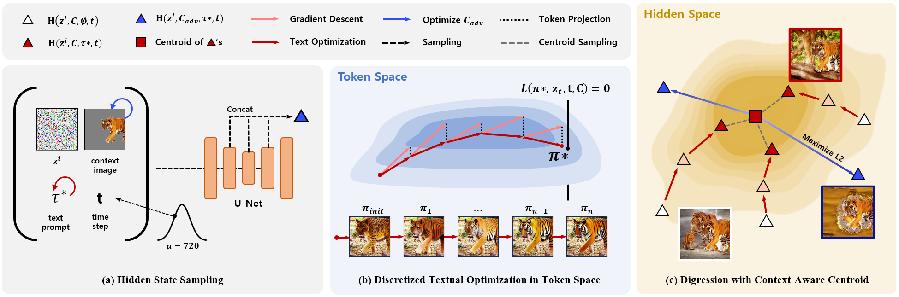
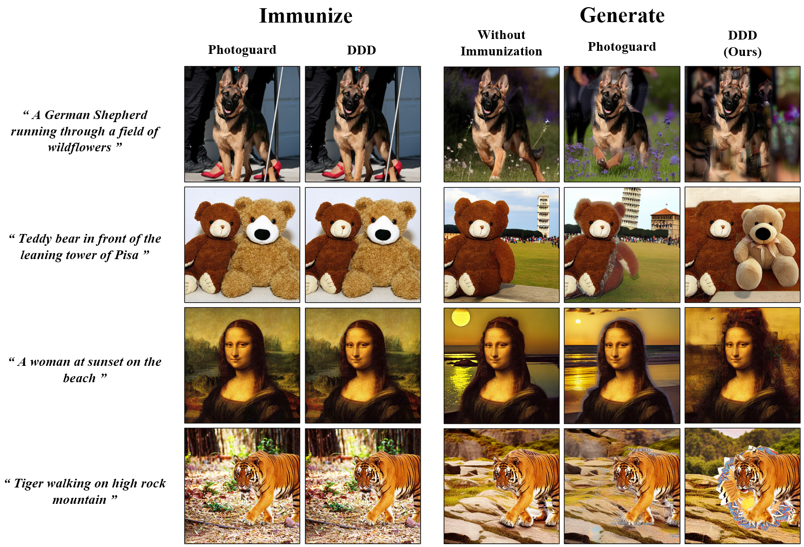

# [IJCAI24] Disrupting Diffusion-based Inpainters with Semantic Digression

[paper](https://www.arxiv.org/pdf/2407.10277)



This is an implementation of the Digression guided Diffusion Disruption (**DDD**) framework. This framework first performs discretized textual optimization in token space to obtain a hard prompt. Subsequently, it generates adversarial noise through an untargeted attack in the hidden space of a masked context image. Our work provides **3 times faster execution** and **3 times lower VRAM usage** compared to PhotoGuard's attack. Additionally, we demonstrate **state-of-the-art performance** through our multi-modal target.

## Usage

TBD


## Results



## Citation
```
@article{son2024disrupting,
  title={Disrupting Diffusion-based Inpainters with Semantic Digression},
  author={Son, Geonho and Lee, Juhun and Woo, Simon S},
  journal={arXiv preprint arXiv:2407.10277},
  year={2024}
}
```
