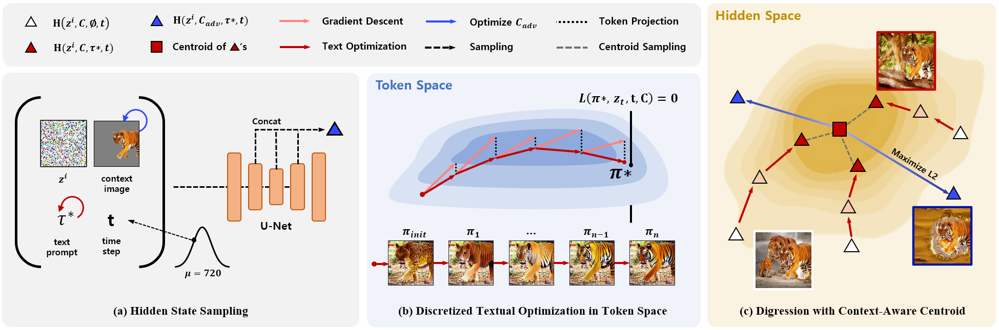
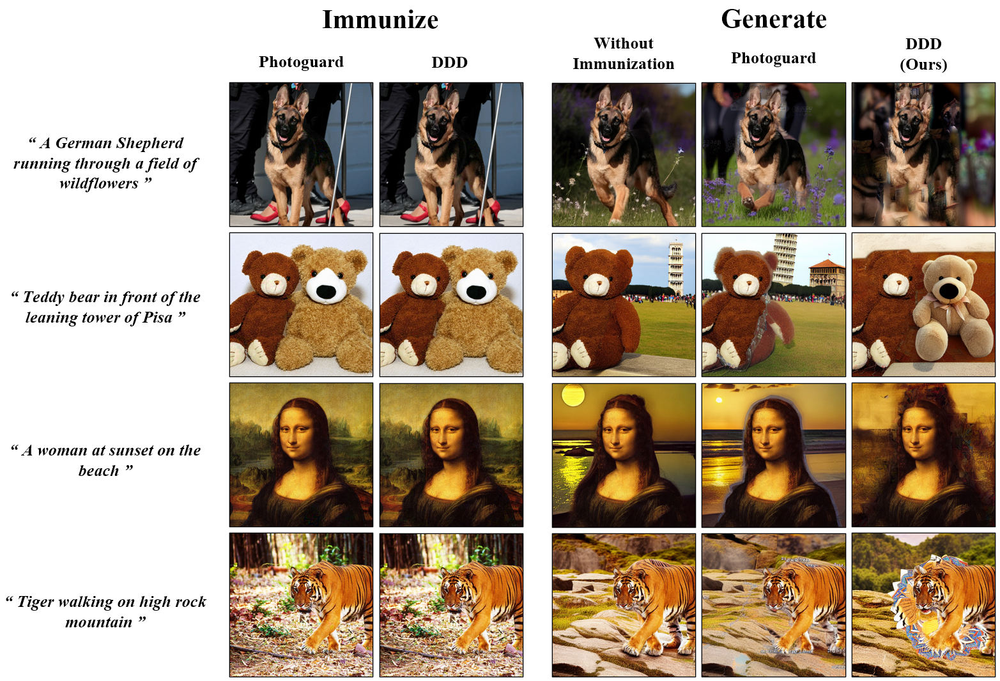

# [IJCAI24] Disrupting Diffusion-based Inpainters with Semantic Digression

[[paper link]](https://www.arxiv.org/pdf/2407.10277)



This is an implementation of the Digression guided Diffusion Disruption (**DDD**) framework. This framework first performs discretized textual optimization in token space to obtain a hard prompt. Subsequently, it generates adversarial noise through an untargeted attack in the hidden space of a masked context image.

## Requirements

Install the required dependencies:

```bash
pip install -r requirements.txt
```

### Key Dependencies:
- PyTorch (>=1.9.0)
- Diffusers (>=0.21.0) 
- Transformers (>=4.21.0)
- Open-CLIP
- Sentence Transformers
- PIL, NumPy, Matplotlib

## Usage

To run the DDD attack, use the provided Jupyter notebook

The notebook contains the complete implementation for:
1. Loading pretrained diffusion models
2. Performing textual optimization to generate hard prompts
3. Generating adversarial noise through untargeted attacks
4. Running the full DDD framework on sample images

Example images and prompts are provided in the `images/` and `prompts/` directories respectively.


## Results



## Citation
```
@article{son2024disrupting,
  title={Disrupting Diffusion-based Inpainters with Semantic Digression},
  author={Son, Geonho and Lee, Juhun and Woo, Simon S},
  journal={arXiv preprint arXiv:2407.10277},
  year={2024}
}
```
